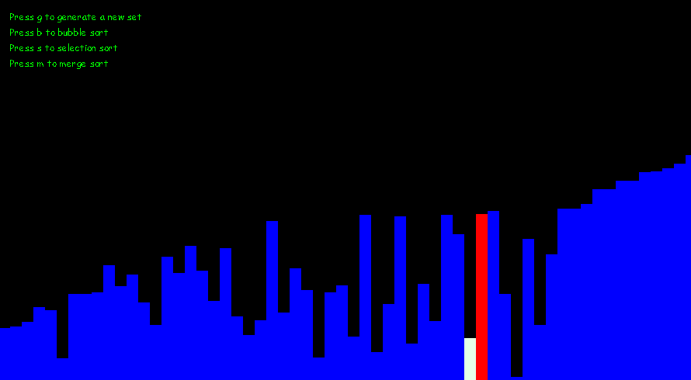

<h1>Sorting Algorithim Visualiser</h1>
 

***Description:*** 
 
This is as simple visualisation tool for various sorting algorithms.
It generates a set of rectangles of random height and then allows
the user to sort them by either merge sort, bubble sort or selection
sort, while showing the user how these algorithms work.

 

 

***Installation:***  
 
Just clone the repo and install the dependencies (pygame) 
with "python3 -m pip install -U pygame --user"